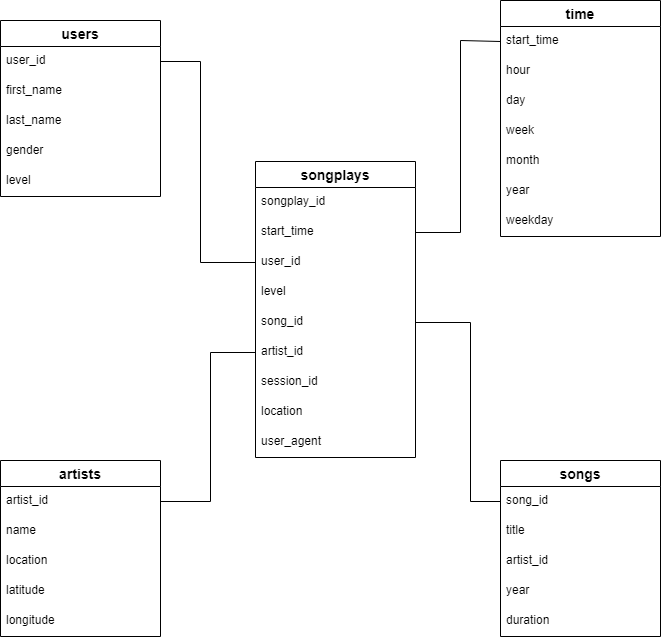

# Project: Data Modeling with Postgres
***

## Table of Contents
* Introduction
* Purpose of Database
* Database Schema
    * Fact Table
    * Dimension Tables
* ETL Pipeline
***

### Introduction
A startup called Sparkify wants to analyze the data they've been collecting on songs and user activity on their new music streaming app in order to understand what songs users are listening to. However, they currently don't have an easy way to query their data, which resides in a directory of JSON logs on user activity on the app, as well as a directory with JSON metadata on the songs in their app. They'd like to request a data engineer to create a Postgres database based on their song and user activity log JSON metadata.
***

### Purpose of database
The purpose of the database is to optimize queries on song play analysis based on the song and user activity log JSON metadata provided by Sparkify. 
***

### Database schema
A star schema is implemented in the database as the following:

#### Fact Table
1. **songplays** - records in log data associated with song plays i.e. records with page NextSong
    * songplay_id, start_time, user_id, level, song_id, artist_id, session_id, location, user_agent
    
#### Dimension Tables
2. **users** - users in the app
    * user_id, first_name, last_name, gender, level
3. **songs** - songs in music database
    * song_id, title, artist_id, year, duration
4. **artists** - artists in music database
    * artist_id, name, location, latitude, longitude
5. **time** - timestamps of records in songplays broken down into specific units
    * start_time, hour, day, week, month, year, weekday
***

### ETL Pipeline
The ETL pipeline is built using Python. There are three functions defined and utilized for ETL as the following:
* def process_data(cur, conn, filepath, func):
Extracts song or log data from JSON files that are in the given filepath, calls process_song_file or process_log_file to transform the data and insert the data into tables, and then commits. 

* def process_song_file(cur, filepath):
Extracts song data from a JSON file, transforms the data and inserts the transformed data into users and artists tables.

* def process_log_file(cur, filepath):
Extracts log data from a JSON file, transforms the data and inserts the transformed data into songs, songplays and time tables.
